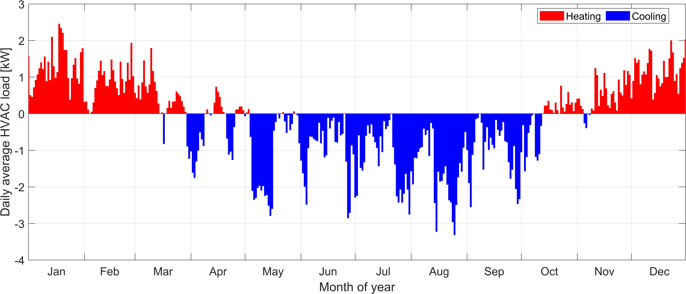
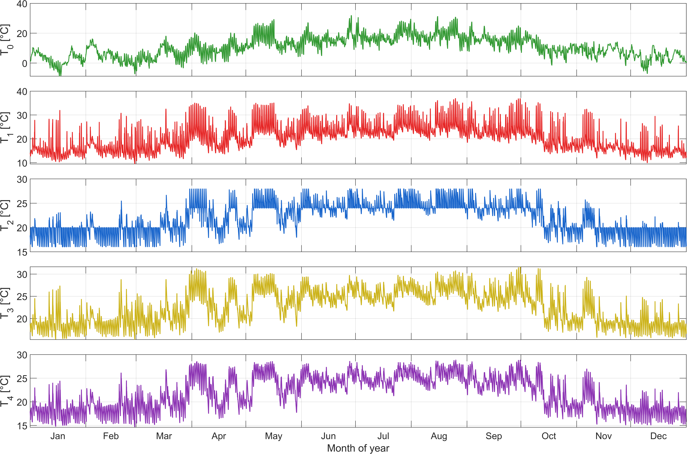
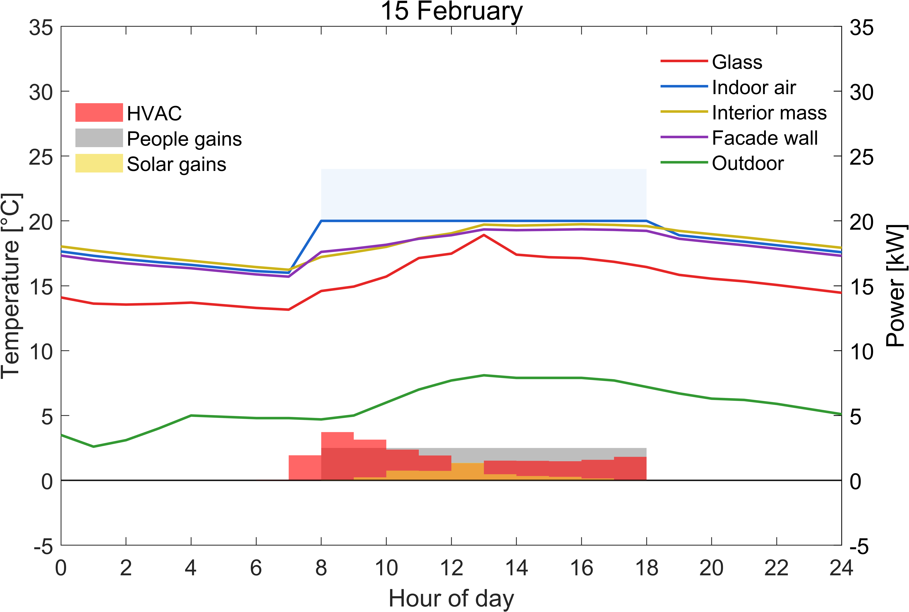
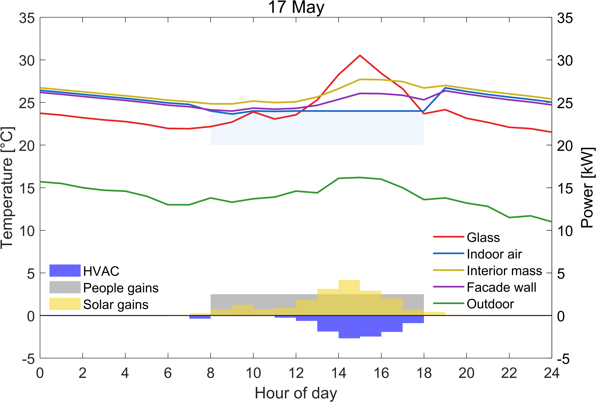

# Assignment 3B — Buildings as Energy and Indoor Climate Systems

This repository contains the MATLAB implementation and post-processing scripts developed for **Assignment 3B** of the course *Buildings as Energy and Indoor Climate Systems*.

The objective of the assignment is to model the thermal behaviour of a single room using a reduced-order approach, couple it with an HVAC control strategy, and evaluate indoor temperatures, HVAC loads, and annual energy consumption under different operating conditions.

---

## 1. Thermal model

The room is represented using a **4-node thermal network**, with the following physical interpretation:

| Node | Description |
|-----:|-------------|
| 0 | Outdoor air |
| 1 | Glazing (window surface) |
| 2 | Indoor air |
| 3 | Interior wall surfaces (thermal mass) |
| 4 | Opaque façade wall surface |

Each node is governed by an energy balance including:
- Convective heat transfer (indoor and outdoor),
- Long-wave radiative exchange between surfaces,
- Solar gains through the glazing,
- Ventilation heat exchange,
- HVAC thermal power input,
- Dynamic thermal storage of the construction (response-factor formulation).

The resulting system is solved at an **hourly time step**.

---

## 2. Model structure and workflow

The annual simulation is implemented in a modular way. Each function has a clearly defined responsibility:

```
main.m
 └── run_simulation.m
      ├── hvac_control.m
      │     └── solve_Q_for_setpoint.m
      └── HHS_model4.m
```

**Description of main components:**

- `main.m`  
  Entry point of the model. Loads climate data, initialises parameters, runs the annual simulation, and saves results.

- `defaults.m`  
  Defines all geometrical, physical, and operational parameters (building properties, internal gains, ventilation, setpoints, HVAC limits).

- `exceldataimport.m`  
  Imports and preprocesses the hourly climate data (outdoor temperature and solar radiation).

- `run_simulation.m`  
  Core annual loop. Applies occupancy schedules, ventilation states, temperature control logic, and coordinates calls to the HVAC controller and thermal model.

- `hvac_control.m`  
  Predicts the end-of-hour indoor air temperature under free-floating conditions and checks compliance with the active setpoint.

- `solve_Q_for_setpoint.m`  
  Computes the HVAC thermal power required to meet the heating or cooling setpoint at the end of the current time step.

- `HHS_model4.m`  
  Evaluates the 4-node thermal model, including thermal-memory effects via response factors.

---

## 3. Control strategy and assumptions

The following assumptions are adopted for the annual simulations:

- Fixed time step of **1 hour** over a full year.
- Climate inputs applied as piecewise-constant values per hour.
- Occupancy from **08:00 to 18:00**; unoccupied otherwise.
- Ventilation active only during occupied periods.
- Two unoccupied-period strategies:
  - **Free-floating** (HVAC off),
  - **Setback** (16 °C heating / 28 °C cooling).
- Occupied-period setpoints:
  - Heating: **20 °C**
  - Cooling: **24 °C**
- Preheating strategy allowing HVAC activation before occupancy to ensure comfort at 08:00.
- HVAC modelled as an ideal thermal power source/sink with bounded capacity.

---

## 4. Results and post-processing

Dedicated scripts in the `plots/` folder generate all figures presented in the report, including:

- Annual temperature profiles for all nodes.
- Annual and daily-average HVAC load profiles.
- Representative winter, spring, summer, and autumn days showing:
  - Indoor and envelope temperatures,
  - HVAC load,
  - Solar gains,
  - Internal gains.
- Mean Radiant Temperature (MRT) versus indoor air temperature during occupied periods.

These results illustrate:
- Seasonal heating and cooling dominance,
- Time-lag effects due to envelope thermal mass,
- The influence of ventilation on HVAC power demand,
- The limited peak-load reduction achieved by setback strategies.

---

## 5. Repository structure

```
.
├── src/          # Core thermal model and HVAC control functions
├── plots/        # Post-processing and figure generation scripts
├── data/         # Climate and input data
├── results/      # Saved simulation outputs (.mat)
├── figures/      # Exported figures (PNG, high resolution)
└── main.m        # Entry point
```

---

## 6. How to run

1. Open MATLAB.
2. Run the main simulation:
   ```matlab
   main
   ```
3. Run the desired scripts in the `plots/` folder to generate figures.

All results are saved automatically in the `results/` and `figures/` directories.

---

## 7. Schematic overview

The figure below illustrates the thermal-node structure and the interaction between the thermal model and the HVAC control logic, as used in the accompanying report.


---

## 8. Example results

The following figures provide a visual overview of the main simulation outputs.

### Annual HVAC loads
Daily-average and hourly HVAC loads over the year, highlighting heating and cooling seasons.



### Annual nodal temperatures
Hourly evolution of outdoor air, glazing, indoor air, interior mass, and façade wall temperatures.



### Representative days
Examples of typical winter, spring, summer, and autumn days, showing temperatures and thermal loads.





December 2025
